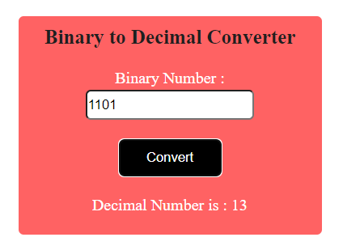

# Description
This is a simple project to convert a Binary Number into Decimal, the project uses HTML,CSS and Javascript.
## Time Taken

1 hours approximately

[Live Demo](https://according-akj.netlify.app/)

### SnapShot of the program

